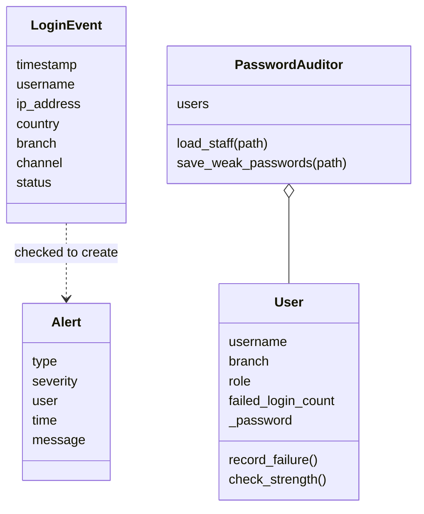

# Week 9 class diagram

```mermaid
classDiagram
    User : username
    User : branch
    User : role
    User : failed_login_count
    User : _password
    User : record_failure()
    User : check_strength()
    LoginEvent : timestamp
    LoginEvent : username
    LoginEvent : ip_address
    LoginEvent : country
    LoginEvent : branch
    LoginEvent : channel
    LoginEvent : status
    Alert : type
    Alert : severity
    Alert : user
    Alert : time
    Alert : message
    PasswordAuditor : users
    PasswordAuditor : load_staff(path)
    PasswordAuditor : save_weak_passwords(path)
    PasswordAuditor o-- User
    LoginEvent ..> Alert : checked to create
```

The underscore in `_password` means other parts of our program should use
`check_strength()` instead of reading the password directly.
